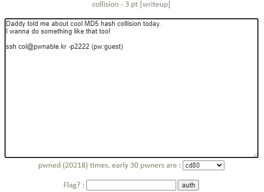
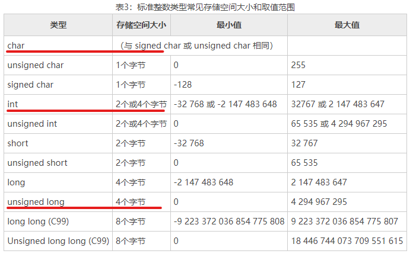
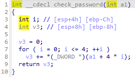
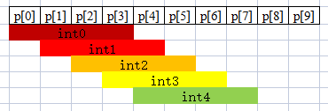
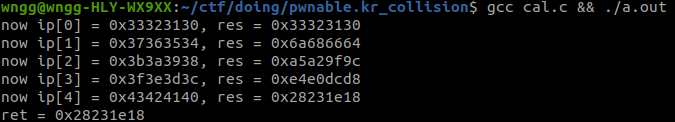
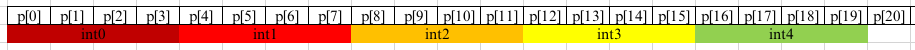
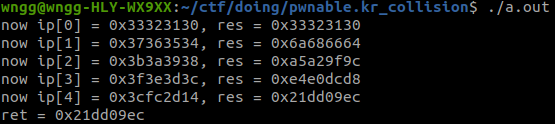
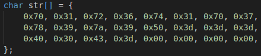
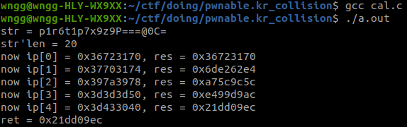
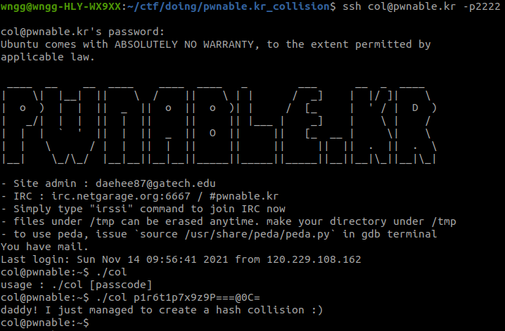

# pwnable.kr_collision

题目类型：Pwn

自定义难度：★☆☆☆☆

## 1 题目



此题附带源码：

```c
#include <stdio.h>
#include <string.h>
unsigned long hashcode = 0x21DD09EC;
unsigned long check_password(const char* p){
        int* ip = (int*)p;
        int i;
        int res=0;
        for(i=0; i<5; i++){
                res += ip[i];
        }
        return res;
}

int main(int argc, char* argv[]){
        if(argc<2){
                printf("usage : %s [passcode]\n", argv[0]);
                return 0;
        }
        if(strlen(argv[1]) != 20){
                printf("passcode length should be 20 bytes\n");
                return 0;
        }

        if(hashcode == check_password( argv[1] )){
                system("/bin/cat flag");
                return 0;
        }
        else
                printf("wrong passcode.\n");
        return 0;
}
```

二进制：[col](pwnable.kr_collision.assets/col)

## 2 解题

### 2.1 分析题目名称和描述

首先分析题目名称，collision 译为碰撞。

题目描述：

> Daddy told me about cool MD5 hash collision today.
> I wanna do something like that too!

译为：

> 爸爸今天跟我说了很酷的MD5哈希碰撞。  
>
> 我也想这么做!  

题目的意思应该是做 MD5 碰撞。

### 2.2 分析源码

将用户输入字符串传入 `check_password` 函数，取字符串前 5 个字符相加后返回，返回值与 `0x21DD09EC` 作比较，相同则得到 Flag。看样子和 MD5 没啥关系。

正常情况下，5 个字符相加最大为 `0xff * 5 = 4FB`，远小于目标 `0x21DD09EC`。`res += ip[i];` 与 `res = ret + ip[i];` 等价，将 `char` 与 `int` 相加，最终累加结果赋值给 `unsigned long`。



Google 得到如上表，这里将 `int` 和 `unsigned long` 当作 4 字节。短类型转换成长类型，好像没什么问题，分析一下二进制文件。



🧐 很奇怪，IDA 将 `check_password` 入参识别为 `int` 类型。

😅 好吧，再仔细观察源码，发现 `ip` 变量将入参从 `char *` 强转为 `int *`。



构造一个字符串，使得上述图中的五个 int 相加为 `0x21DD09EC` ，注意大小端问题。如果暴力破解的话，需要遍历 2^56 次，显然不可能。以数学的角度分析一下：

(身略一个小时的分析内容)

分析了半天，试了半天，发现怎么都对不上，最后写个程序试试：

```c
#include <stdio.h>

unsigned long check_password(const char* p){
    int* ip = (int*)p;
    int i;
    int res=0;
    for(i=0; i<5; i++){
        res += ip[i];
        printf("now ip[%d] = 0x%x, res = 0x%x\n", i, ip[i], res);
    }
    return res;
}

int main()
{
    char str[] = {
        0x30, 0x31, 0x32, 0x33, 0x34, 0x35, 0x36, 0x37,
        0x38, 0x39, 0x3a, 0x3b, 0x3c, 0x3d, 0x3e, 0x3f,
        0x40, 0x41, 0x42, 0x43, 0x44, 0x45, 0x46, 0x47,
    };
    unsigned long ret = check_password(str);
    printf("ret = 0x%lx\n", ret);

    return 0;
}
```

运行结果：



😅 好吧，将 `char *` 转换为 `int *` 后，数组下标递增也是按照 `int` 长度递增的，也就是如下图所示：



这样看来的话简单很多，构造 5 个整数相加为 `0x21DD09EC` 即可。看看上面测试代码构造出的相加溢出后最终为 `0x28231E18` ，多了 `0x646142C` ，把 `ip[4]` 减去则为 `0x43424140 - 0x646142C = 0x3CFC2D14`。测试结果如下：



结果正常，但是 `0xfc` 这样的 ascii 码不可显示，再分配一下，最终结果为：





## 3 EXP

```bash
ssh col@pwnable.kr -p2222 # pw:guest
./col p1r6t1p7x9z9P===@0C=
```

