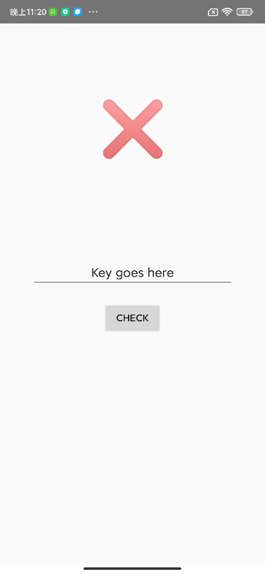
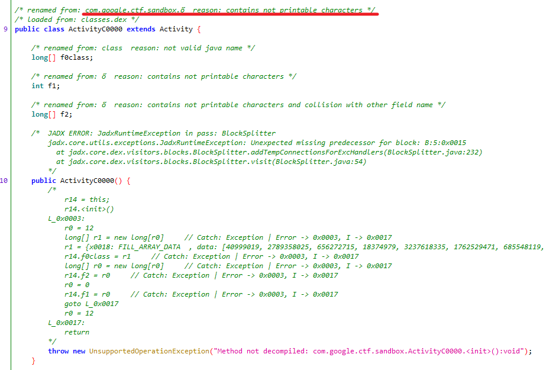
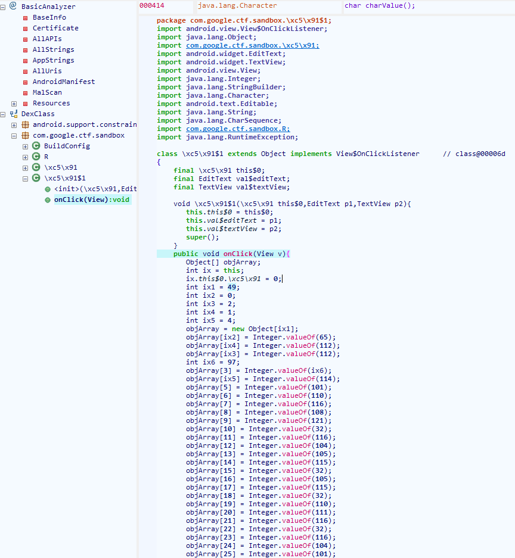
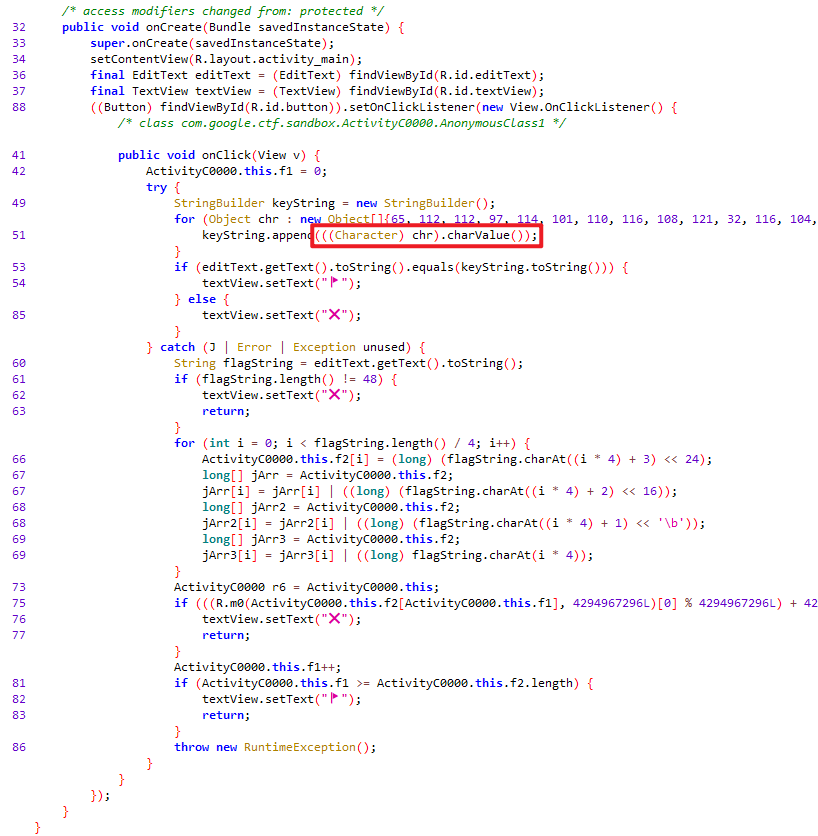
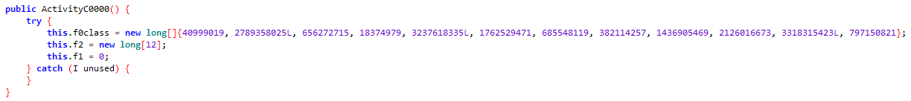
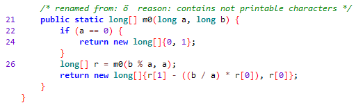
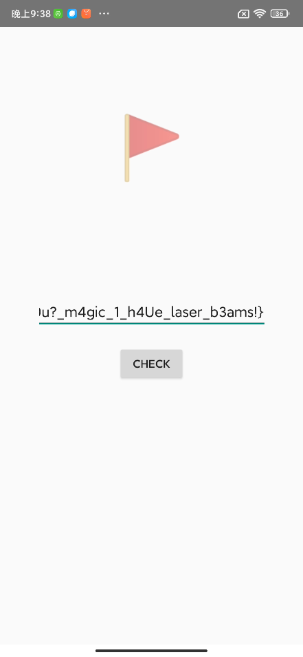

# android

> Can you find the correct key to unlock this app?

[reverse.apk](android.assets/reverse.apk)



It should be to enter the correct key to get the flag, drag to jadx.



The key function is not directly disassembled, probably because of these not printable characters. Try to fix. 🥳

Abandoned the repair and found that it can be reversed using GDA. 😶



Probably the logic is as follows:

```java
class \xc5\x91$1 extends Object implements View$OnClickListener	// class@00006d
{
    final \xc5\x91 this$0;
    final EditText val$editText;
    final TextView val$textView;

    void \xc5\x91$1(\xc5\x91 this$0,EditText p1,TextView p2){
       this.this$0 = this$0;
       this.val$editText = p1;
       this.val$textView = p2;
       super();
    }
    public void onClick(View v){
       this.this$0.\xc5\x91 = 0;
       String keyString = "Apparently this is not the flag. What's going on?"
       if (this.val$editText.getText().toString().equals(keyString.toString())) {
          ix.val$textView.setText("\xed\xa0\xbd\xed\xba\xa9");
       }else {
          this.val$textView.setText("\xe2\x9d\x8c");
       }
       return;
    }
}
```

It seems very simple, but the result is wrong...



I replaced jadx with version 1.2.0 and the key code was disassembled, `(Character) chr` throw an exception.





Concatenate the input string into an array, and enter `m0` function separately, if the result is the same as `f0class`, get the flag. Part the code and brute.

```python
TARGET_TABLE = [
    40999019, 2789358025, 656272715, 18374979,
    3237618335,1762529471, 685548119, 382114257,
    1436905469, 2126016673, 3318315423, 797150821
]


def m0(a, b):
    if a == 0:
        return [0, 1]
    r = m0(b % a, a)
    return [r[1] - ((b // a) * r[0]), r[0]]


if __name__ == "__main__":
    for c1 in range(33, 128):
        print("running({}/128) ...".format(c1))
        for c2 in range(33, 128):
            for c3 in range(33, 128):
                for c4 in range(33, 128):
                    value = c4 << 24 | c3 << 16 | c2 << 8 | c1
                    result = ((m0(value, 4294967296)[0] % 4294967296) + 4294967296) % 4294967296
                    if result in TARGET_TABLE:
                        print("{}{}{}{} match {}".format(chr(c1), chr(c2), chr(c3), chr(c4), result))
```

Flag is

```text
CTF{y0u_c4n_k3ep_y0u?_m4gic_1_h4Ue_laser_b3ams!}
```


