# pwnable.kr_flag

题目类型：Reverse

自定义难度：★☆☆☆☆

## 1 题目

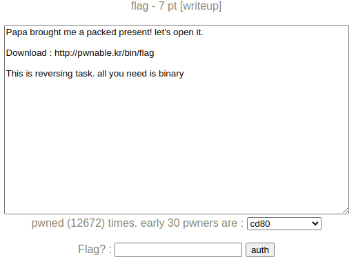

附件：[flag](pwnable.kr_flag.assets/flag)

## 2 解题

### 2.1 分析题目

看题目应该是一道逆向题，运行一下看看：

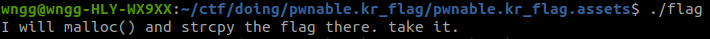

仅是输出了一段话，ida 逆向看看，一眼难，还是先学一下逆向题目基础吧。[ctf-wiki reverse](https://ctf-wiki.org/reverse/introduction/)

搜索字符串也没有搜到运行时打印的字符串，只有这三个字符串。

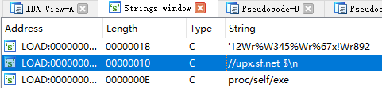

这个 `upx.sf.net` 在之前 `checksec` 时也看到相关的。

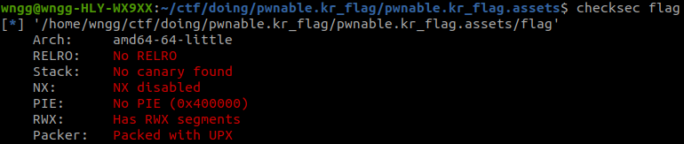

Google 一下 UPX，应该是一个加壳器，Google 一下 UPX 脱壳技巧吧。


### 2.2 UPX 脱壳练手

为了学习一下脱壳技巧，我们自己写个 `hello_world.c` 编译加壳后分析一下，磨刀不误砍柴工。

```c
#include <stdio.h>

int main()
{
    printf("hello world!\n");
    return 0;
}
```

编译，打包：

```bash
gcc --static -o hello_world hello_world.c
cp hello_world hello_world_upxed
upx hello_world_upxed
```

基于这两个二进制学习一下 upx 脱壳技术。

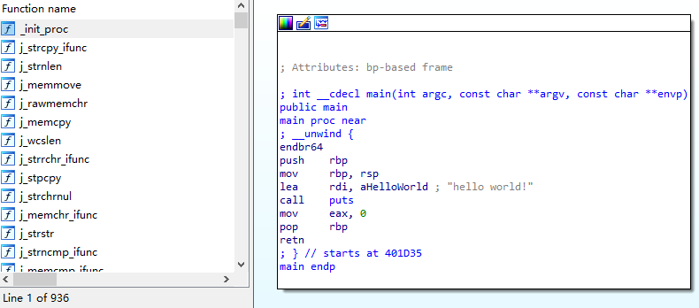

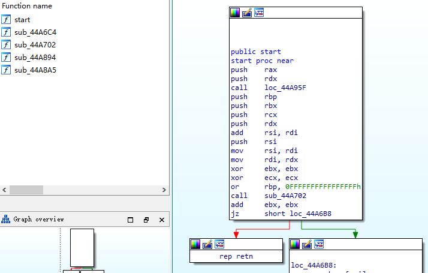

上述分别为 `hello_world` 和 `hello_world_upxed` 逆向出来的样子，差距还是非常大的，upx 加壳后的逆向结果和题目二进制逆向结果非常相似，看样子应该是一个脱壳题了。

**upx 脱壳技巧**

本节以 `hello_world_upxed` 为例。

> UPX 其实现压缩的方法是在程序原先代码之前再插入一段代码，因此在加壳程序运行前这段代码会先被运行，其作用则是解压缩加壳程序的代码到某一内存段或临时文件上，在全部解压缩完毕后跳至该内存段执行程序的真正代码，通常的，称这个入口为OEP。
>
> [upx壳与脱壳技巧](http://www.qfrost.com/CTF/upx/)

upx 是一种压缩壳，不具备加密能力，对于它的脱壳还是比较容易的，基本的脱壳原理可以学习这篇文章：[【新手教程三】小Z带你学习什么是ESP定律和什么是堆栈平衡 ？](https://www.52pojie.cn/thread-394116-1-1.html)。

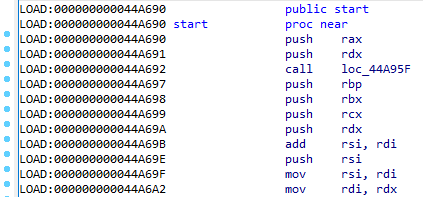

程序开始的这些 push 应个就是进入解压代码前的保留现场了，gdb 在程序开始处打下断点，看一下这一段 push 完后的栈地址。

```text
b *0x44a690
```

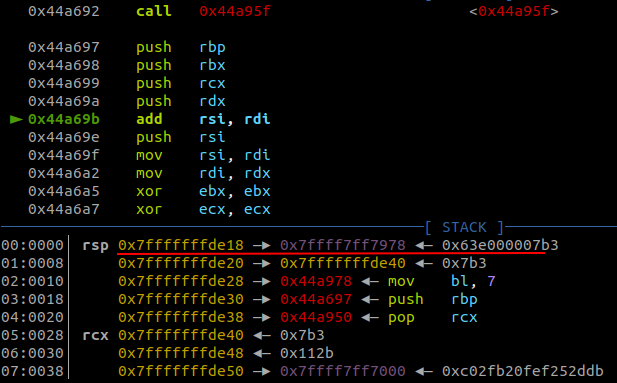

push 完后栈顶 `sp` 为 `0x7fffffffde18`，给这个地址下一个访问断点（数据断点、硬件断点）。

```text
watch *0x7fffffffde18
c
```

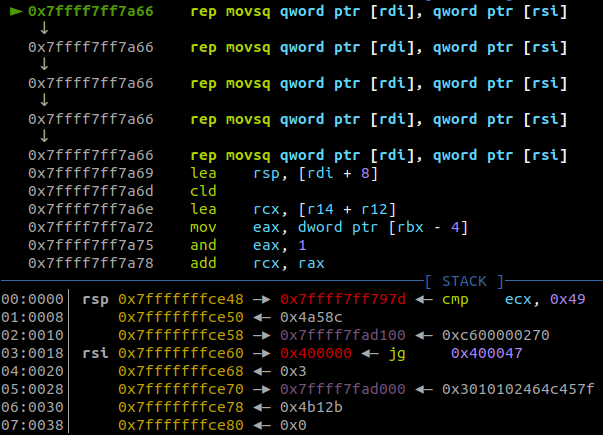

第一次访问好像不是我们想要的，试试再 `c` 一下。	

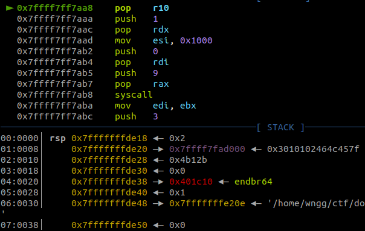

这一次应该是预期的，栈内容和一开始 push 的内容一样。但是继续单步运行了很久，还是没有进入正常的程序，难道只是 pop 了上面几个数据，实际上还是在解压程序部分？继续 watch 更深的栈地址看看。

emm，还是没有找到解压后的代码段，好像 64 位的 upx 不支持上述方法？🤡

不过我在汇编代码里找到了这一段刚好和一开始 push 顺序对应的 pop 代码。

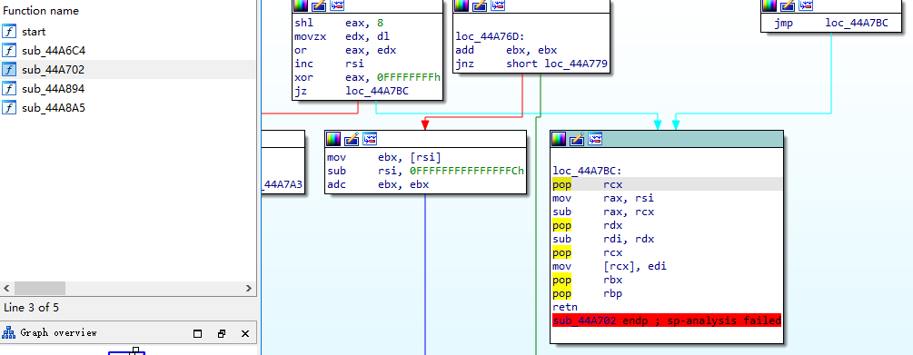

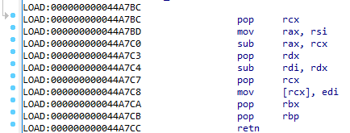

打个断点试试。

```text
b *0x44a7bc
```

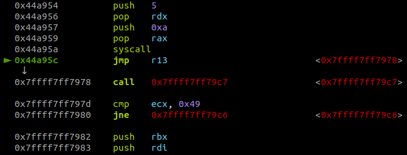

s 了几步之后，这里有个很可疑的 `jmp` ，从 `0x44a95c` 跳到了 `0x7ffff7ff7978`，dump 出来拖入 ida 看看。

```text
dump memory ~/temp/m0.dump 0x7ffff7ff7978 0x7ffff7ff9000
```

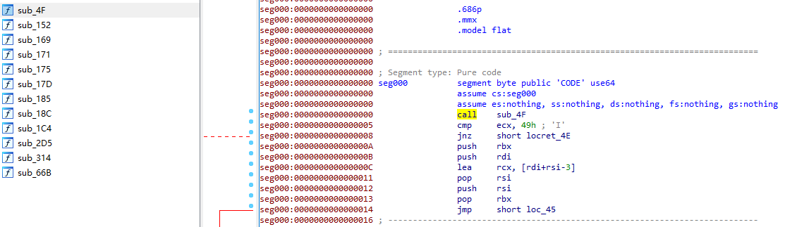

搜索不到字符串，应该不是解压后的代码，可能还有一次大跳转，gdb单步一直循环，结合静态代码一起分析一下吧。

（dump 出来的汇编代码对应地址是基于 `0x7ffff7ff7978` 地址的偏移，可以通过 Edit -> Segments ->Rebase Program 修改基址）

OK，试了半天，终于放弃了，直接用现有的脱壳软件吧。🤗

```bash
upx -d flag
```

### 2.3 脱壳后调试

脱壳后真是一目了然鸭，根据提示，直接对 `strcpy` 打断点运行。

```text
b strcpy
r
```

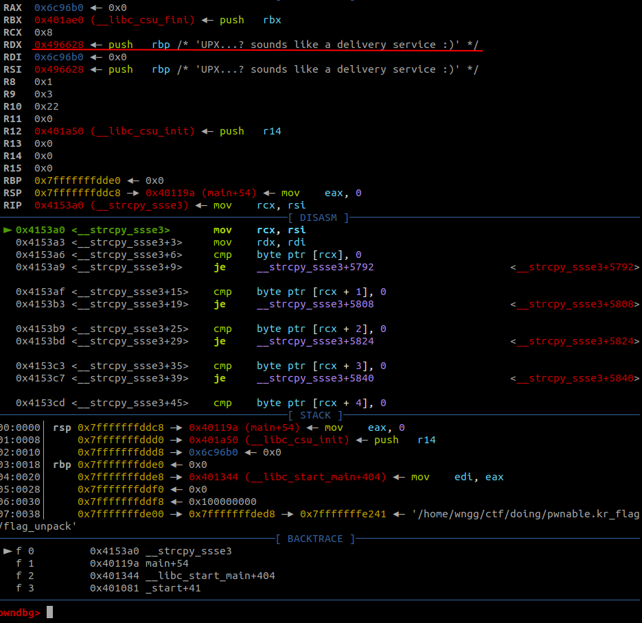

## 3 EXP

null

## 4 总结

1. 逆向题先利用查壳器看看，如 [Detect It Easy](https://github.com/horsicq/Detect-It-Easy)

## 附录A：参考

- [upx壳与脱壳技巧](http://www.qfrost.com/CTF/upx/)
- [【新手教程三】小Z带你学习什么是ESP定律和什么是堆栈平衡 ？](https://www.52pojie.cn/thread-394116-1-1.html)