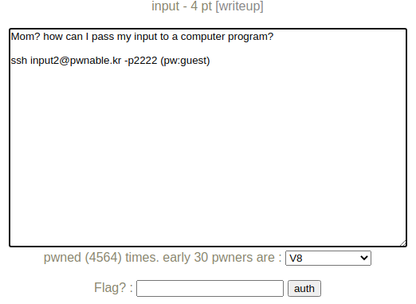
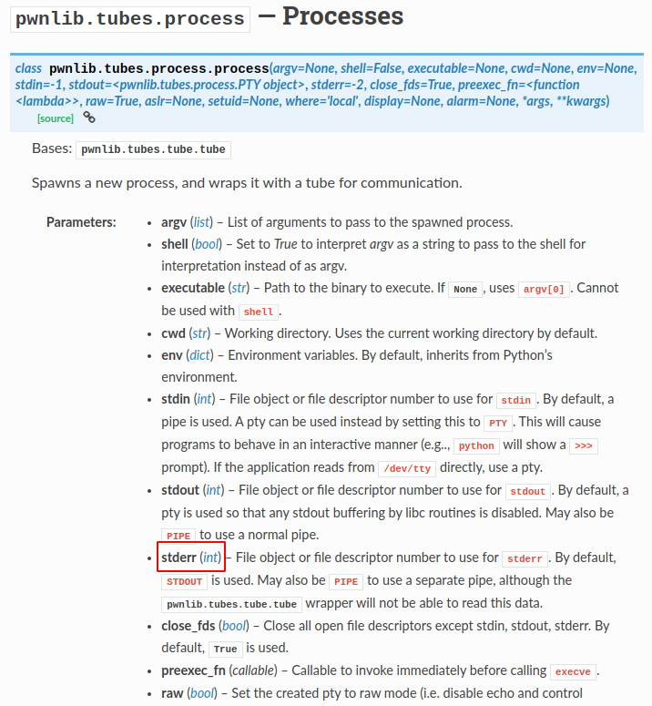
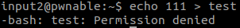
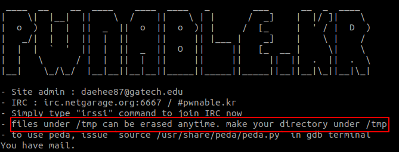
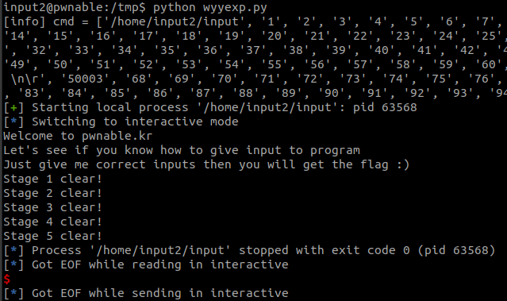

# pwnable.kr_input

题目类型：Misc

自定义难度：★☆☆☆☆

## 1 题目



此题提供源码：

```c
#include <stdio.h>
#include <stdlib.h>
#include <string.h>
#include <sys/socket.h>
#include <arpa/inet.h>

int main(int argc, char* argv[], char* envp[]){
	printf("Welcome to pwnable.kr\n");
	printf("Let's see if you know how to give input to program\n");
	printf("Just give me correct inputs then you will get the flag :)\n");

	// argv
	if(argc != 100) return 0;
	if(strcmp(argv['A'],"\x00")) return 0;
	if(strcmp(argv['B'],"\x20\x0a\x0d")) return 0;
	printf("Stage 1 clear!\n");	

	// stdio
	char buf[4];
	read(0, buf, 4);
	if(memcmp(buf, "\x00\x0a\x00\xff", 4)) return 0;
	read(2, buf, 4);
        if(memcmp(buf, "\x00\x0a\x02\xff", 4)) return 0;
	printf("Stage 2 clear!\n");
	
	// env
	if(strcmp("\xca\xfe\xba\xbe", getenv("\xde\xad\xbe\xef"))) return 0;
	printf("Stage 3 clear!\n");

	// file
	FILE* fp = fopen("\x0a", "r");
	if(!fp) return 0;
	if( fread(buf, 4, 1, fp)!=1 ) return 0;
	if( memcmp(buf, "\x00\x00\x00\x00", 4) ) return 0;
	fclose(fp);
	printf("Stage 4 clear!\n");	

	// network
	int sd, cd;
	struct sockaddr_in saddr, caddr;
	sd = socket(AF_INET, SOCK_STREAM, 0);
	if(sd == -1){
		printf("socket error, tell admin\n");
		return 0;
	}
	saddr.sin_family = AF_INET;
	saddr.sin_addr.s_addr = INADDR_ANY;
	saddr.sin_port = htons( atoi(argv['C']) );
	if(bind(sd, (struct sockaddr*)&saddr, sizeof(saddr)) < 0){
		printf("bind error, use another port\n");
    		return 1;
	}
	listen(sd, 1);
	int c = sizeof(struct sockaddr_in);
	cd = accept(sd, (struct sockaddr *)&caddr, (socklen_t*)&c);
	if(cd < 0){
		printf("accept error, tell admin\n");
		return 0;
	}
	if( recv(cd, buf, 4, 0) != 4 ) return 0;
	if(memcmp(buf, "\xde\xad\xbe\xef", 4)) return 0;
	printf("Stage 5 clear!\n");

	// here's your flag
	system("/bin/cat flag");	
	return 0;
}
```

二进制：[input](pwnable.kr_input.assets/input)

## 2 解题

简单的读了一下题目，运行了一下程序，应该是找到程序的输入点。看看源码吧。

看起来有很多关，慢慢分析吧。

### 第一关：argv

```c
	// argv
	if(argc != 100) return 0;
	if(strcmp(argv['A'],"\x00")) return 0;
	if(strcmp(argv['B'],"\x20\x0a\x0d")) return 0;
	printf("Stage 1 clear!\n");	
```

（❌错误理解）输入 100 并且第 66('A' + 1) 位是 `\x00` 第 67('B' + 1) ~ 69 位是 `\x20\x0a\x0d`，验证一下。

发现不行，调了一下，应该是第二个 `strcmp` 比较字符串没有遇到截断符号，70 位再加个 `\x00` 试试。

好吧，原来 `argc == 100` 都没有达成呢 🙄。

（✔️）应该是输入 99 个入参，第 66('A' + 1) 个入参是 `\x00`，第 67('B' + 1)  个入参是 `\x20\x0a\x0d`。

```python
cmd = ["./a.out"]
for i in range(1, 100):
    if i == 65:
        cmd.append(b"\x00")
    elif i == 66:
        cmd.append(b"\x20\x0a\x0d")
    else:
        cmd.append(str.encode("{}".format(i)))
```

即可通过第一关

### 第二关：stdio

```c
	// stdio
    char buf[4];
	read(0, buf, 4);
	if(memcmp(buf, "\x00\x0a\x00\xff", 4)) return 0;
	read(2, buf, 4);
        if(memcmp(buf, "\x00\x0a\x02\xff", 4)) return 0;
	printf("Stage 2 clear!\n");
```

分别读一次 stdin 和 stderr，stdin 的话比较容易，直接 `sendline` 即可，stderr 的话查了点资料，最终发现 pwntools 的 `process` 是有提供重定向 stderr 功能的。



注意：我用 `f.write("\x00\x0a\x02\xff") `写文件时最终写的结果为 `00 0A 02 C3 BF`，`open` 的时候类型加上一个`b` 即可，`f = open("./stderr", "wb+")`。

```python
from pwn import *

cmd = ["./a.out"]
for i in range(1, 100):
    if i == 65:
        cmd.append(b"\x00")
    elif i == 66:
        cmd.append(b"\x20\x0a\x0d")
    else:
        cmd.append(str.encode("{}".format(i)))

print("[info] cmd = {}".format(cmd))

f = open("./stderr", "wb+")
f.write(b"\x00\x0a\x02\xff")
f.close()

io = process(cmd, stderr=open("./stderr"))

io.sendline(b"\x00\x0a\x00\xff")

io.interactive()
```

第二关就过关啦。

### 第三关：env

```c
	// env
	if(strcmp("\xca\xfe\xba\xbe", getenv("\xde\xad\xbe\xef"))) return 0;
	printf("Stage 3 clear!\n");
```

查了一下 `getenv` 函数，应该是获取全局变量。exp 中的 `process` 家一个 `env` 入参即可。

```python
io = process(cmd, env = {"\xde\xad\xbe\xef": "\xca\xfe\xba\xbe"}, stderr=open("./stderr"))
```

### 第四关：file

```c
	// file
	FILE* fp = fopen("\x0a", "r");
	if(!fp) return 0;
	if( fread(buf, 4, 1, fp)!=1 ) return 0;
	if( memcmp(buf, "\x00\x00\x00\x00", 4) ) return 0;
	fclose(fp);
	printf("Stage 4 clear!\n");	
```

应该是读取文件内容，exp 中加上如下即可。

```python
f = open("./" + "\x0a", "wb+")
f.write(b"\x00\x00\x00\x00")
f.close()
```

### 第五关：network

```python
	// network
	int sd, cd;
	struct sockaddr_in saddr, caddr;
	sd = socket(AF_INET, SOCK_STREAM, 0);
	if(sd == -1){
		printf("socket error, tell admin\n");
		return 0;
	}
	saddr.sin_family = AF_INET;
	saddr.sin_addr.s_addr = INADDR_ANY;
	saddr.sin_port = htons( atoi(argv['C']) );
	if(bind(sd, (struct sockaddr*)&saddr, sizeof(saddr)) < 0){
		printf("bind error, use another port\n");
    		return 1;
	}
	listen(sd, 1);
	int c = sizeof(struct sockaddr_in);
	cd = accept(sd, (struct sockaddr *)&caddr, (socklen_t*)&c);
	if(cd < 0){
		printf("accept error, tell admin\n");
		return 0;
	}
	if( recv(cd, buf, 4, 0) != 4 ) return 0;
	if(memcmp(buf, "\xde\xad\xbe\xef", 4)) return 0;
	printf("Stage 5 clear!\n");
```

看起来第五关应该时接受网络输入，看起来时最难的一关。

```python
saddr.sin_port = htons( atoi(argv['C']) ); // 'C' = 67
```

这一行应该是定义了监听端口，通过命令行参数决定。这里我们设置成 `50001` ，exp 中加上如下代码。

```python
client = socket.socket()
client.connect(("127.0.0.1", 50002))
client.send(b"\xde\xad\xbe\xef")
```

### 远程调试



远程调试出错，试了一下，应该是没有权限新建文件。看看 exp 中的文件能不能利用其他方式。



好像这个目录是可以用的，试试。直接在 `/tmp` 路径下复制 exp 运行。



emmmm，很奇怪，看日志是全部过关了，但是没有给我 flag。

## 3 EXP

```python
from pwn import *

# cmd = ["./input"]
cmd = ["/home/input2/input"]
for i in range(1, 100):
    if i == 65:
        cmd.append(b"\x00")
    elif i == 66:
        cmd.append(b"\x20\x0a\x0d")
    elif i == 67:
        cmd.append(b"50008")
    else:
        cmd.append(str.encode("{}".format(i)))

print("[info] cmd = {}".format(cmd))

f = open("/tmp/stderr", "wb+")
f.write(b"\x00\x0a\x02\xff")
f.close()

f = open("\x0a", "wb+")
f.write(b"\x00\x00\x00\x00")
f.close()

io = process(cmd, env = {"\xde\xad\xbe\xef": "\xca\xfe\xba\xbe"}, stderr=open("/tmp/stderr"))

io.sendline(b"\x00\x0a\x00\xff")

io.recvuntil("Stage 4 clear!")
client = socket.socket()
client.connect(("127.0.0.1", 50008))
client.send(b"\xde\xad\xbe\xef")

io.interactive()
```

## 存疑

1. 为啥都过关了没有 flag？
2. `fopen` 是相对路径还是绝对路径？为啥在 `/tmp` 路径下的脚本新建文件 `"\x0a"`，在 `/home/input2/` 路径下的 `input` 程序可以同样以 "\x0a" 读到。