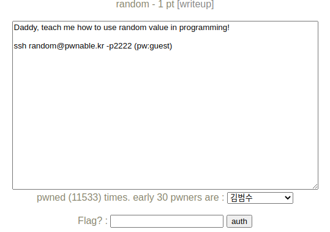
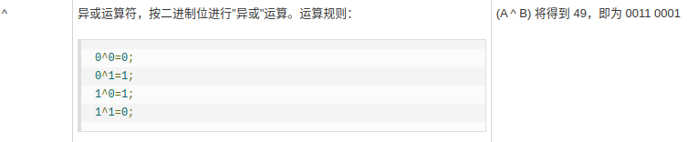
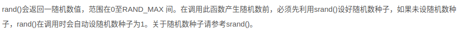
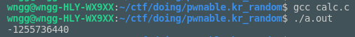
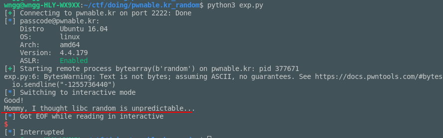

# pwnable.kr_random

题目类型：Misc

自定义难度：★☆☆☆☆

## 1 题目



此题附带源码：

```c
#include <stdio.h>

int main(){
        unsigned int random;
        random = rand();        // random value!

        unsigned int key=0;
        scanf("%d", &key);

        if( (key ^ random) == 0xdeadbeef ){
                printf("Good!\n");
                system("/bin/cat flag");
                return 0;
        }

        printf("Wrong, maybe you should try 2^32 cases.\n");
        return 0;
}
```

二进制：[random](pwnable.kr_random.assets/random)

## 2 解题

输入 `key` ，如果 `key ^ rand() == 0xdeadbeaf` 即可拿到 flag，能输入的点只有 `key`，并且 `%d` 限制了只获取输入的 4 个字节，看起来没有什么溢出的点。



 `^` 运算符是按照位异或。



`rand` 函数如果没有预设种子的话，为自动设置随机种子为 1，理论上种子相同，随机序列也是相同的。也就是说我们本地调用一次的结果应该和靶机调用的值是一样的。再简单的计算一下 key 值。

```c
key ^ random == 0xdeadbeef
->
key ^ random ^ random == 0xdeadbeef ^ random
->
key == 0xdeadbeef ^ random
```

本地计算一下吧。

```c
#include <stdlib.h>
#include <stdio.h>

int main()
{
    unsigned int random;
    random = rand();
    unsigned int key = random ^ 0xdeadbeef;
    printf("%d\n", key);
    return 0;
}
```



理论上输入 `-1255736440` 即可，验证也是正确的。



拿到 flag。

## 3 EXP

```python
from pwn import *

session = ssh("random", "pwnable.kr", 2222, "guest")

io = session.process("random")
io.sendline("-1255736440")

io.interactive()
```

## 4 总结

比较简单。

