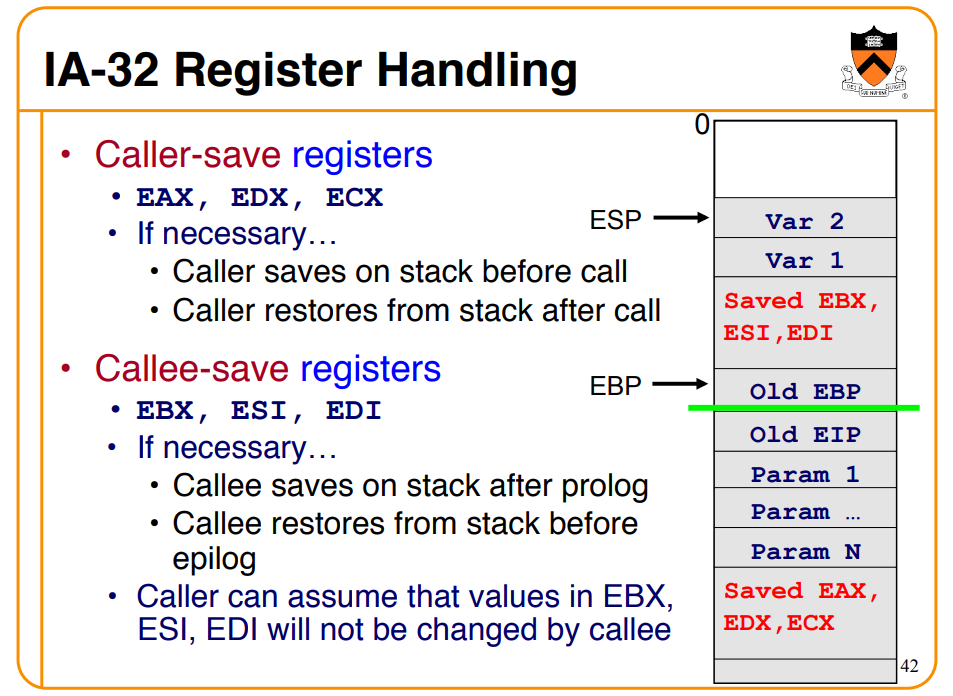

# note

## pwn

### 思路

1. 列出每个漏洞点和能利用的点（例如可以改某地址为任意值）是什么？

### 考虑的点

- ret2text（指令必可以执行）

  看看代码段中有没有可以利用的汇编片段。

- ret2got（指令必可以执行）

  看看程序中有没有使用动态库中函数，可以覆盖 got 表地址。

- 

## search

### assembly call stack



### man

```bash
man man
```

## tools

查壳：[Detect It Easy](https://github.com/horsicq/Detect-It-Easy)

## exp

### pwntools

#### recv

```python
receive = sh.recvline()
print('\033[92m[✔ recv]\033[0m {}'.format(receive))
```

#### send

```python
sh.sendline(padding)
print('\033[92m[✔ send]\033[0m {}'.format(padding))
```

### sh

#### input bytes

```sh
# 1
`printf "\xAA\xBB"`

# 2
python -c "print '\xAA\xBB'" | ./passcode
```

## shellcode

### execve sh

```python
asm_code = '''
    push 68732d    /* 682f736800 */
    push 6e69622f
    xor edx, edx
    xor ecx, ecx
    mov ebx, esp
    mov eax, 0xb
    int 0x80
'''
shellcode = asm(asm_code)
```

